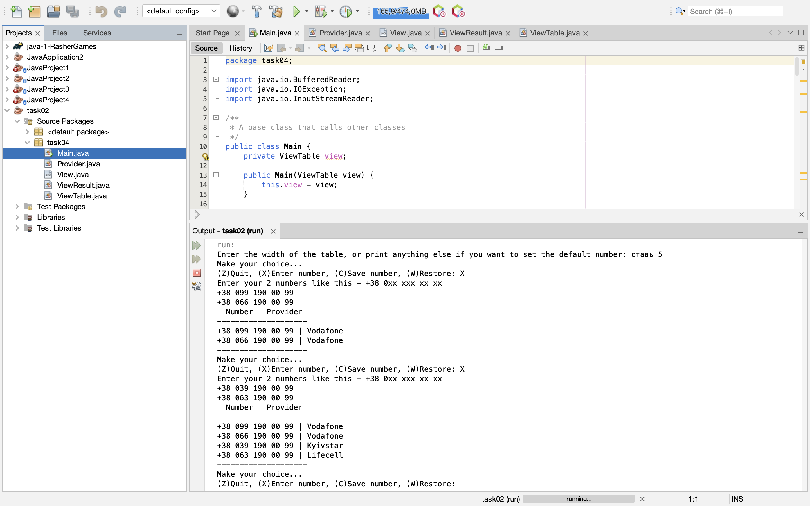

# Ткаченко Микола, 34 група
Практика

# TkachenkoMykola-34

+ [task01](#task01)

## #task01:
Завдання:

Виконати розробку найпростішої консольної програми на Java, наприклад,
що виводить на екран усі аргументи командного рядка, задані при запуску
та розмістити її у локальному сховищі.

# Результат запуску коду:

+ [task02](#task02)

## #task02:
Завдання:

Визначити мобільного оператора за заданим номером абонента.

Розробити клас, що серіалізується, для зберігання параметрів і результатів
обчислень.
Використовуючи агрегування, розробити клас для знаходження рішення
задачі.
Розробити клас для демонстрації в діалоговому режимі збереження та
відновлення стану об'єкта, використовуючи серіалізацію. Показати особливості
використання transient полів.
Розробити клас для тестування коректності результатів обчислень та
серіалізації/десеріалізації.
Використовувати докладні коментарі для автоматичної генерації
документації засобами javadoc.

# Результат запуску коду:

+ [task03-02](#task03-02)

## #task03-02:
Завдання:

1. Як основа використовувати вихідний текст проекту попередньої лабораторної роботи. Забезпечити розміщення результатів обчислень уколекції з можливістю збереження/відновлення.
2. Використовуючи шаблон проектування Factory Method (Virtual Constructor), розробити ієрархію, що передбачає розширення рахунок додавання
нових відображуваних класів.
3. Розширити ієрархію інтерфейсом "фабрикованих" об'єктів, що представляє набір методів для відображення результатів обчислень.
4. Реалізувати ці методи виведення результатів у текстовому виде.
5. Розробити тареалізувати інтерфейс для "фабрикуючого" методу.

# Результат запуску коду:

+ [task04-02](#task04-02)

## #task04-02:
Завдання:

1.За основу використовувати вихідний текст проекту попередньої лабораторної роботи Використовуючи шаблон проектування Factory Method
(Virtual Constructor), розширити ієрархію похідними класами, реалізують методи для подання результатів у вигляді текстової
таблиці. Параметри відображення таблиці мають визначатися користувачем.
2.Продемонструвати заміщення (перевизначення, overriding), поєднання (перевантаження, overloading), динамічне призначення методів
(Пізнє зв'язування, поліморфізм, dynamic method dispatch).
3. Забезпечити діалоговий інтерфейс із користувачем.
4. Розробити клас для тестування основної функціональності.
5. Використати коментарі для автоматичної генерації документації засобами javadoc.

# Результат запуску коду:

+ [task05-02](#task05-02)

## #task05-02:
Завдання:

1. Реалізувати можливість скасування (undo) операцій (команд).
2. Продемонструвати поняття "макрокоманда"
3.При розробці програми використовувати шаблон Singletone.
4. Забезпечити діалоговий інтерфейс із користувачем.
5.Розробити клас для тестування функціональності програми.

# Результат запуску коду:

